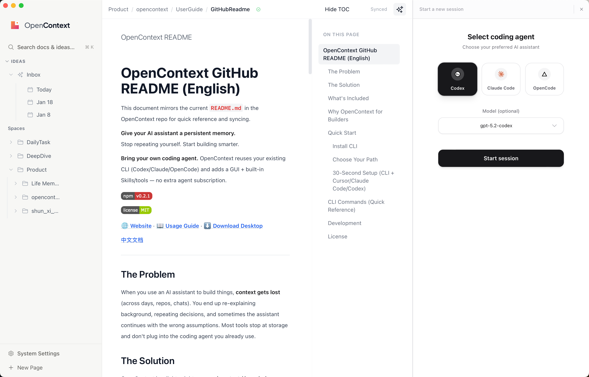

<div align="center">
  <picture>
    <source media="(prefers-color-scheme: dark)" srcset="docs/images/logo-dark.png">
    <source media="(prefers-color-scheme: light)" srcset="docs/images/logo-light.png">
    
  </picture>

  <p>
    <strong>给你的 AI 助手一个持久记忆。</strong><br>
    不再重复解释，专注高效构建。
  </p>

  <p>
    <strong>复用你已有的 coding agent。</strong> OpenContext 直接接入你现有的 CLI（Codex/Claude/OpenCode），并提供 GUI + 内置 Skills/工具，无需额外为另一套 Agent 付费。
  </p>

  <!-- Overview -->
  

  <!-- Demo GIF -->
  

  <p>
    <a href="https://www.npmjs.com/package/@aicontextlab/cli"></a>
    <a href="https://github.com/0xranx/OpenContext/blob/main/LICENSE"></a>
  </p>

  <p>
    <a href="https://0xranx.github.io/OpenContext/zh/"><strong>🌐 官网</strong></a> · 
    <a href="https://0xranx.github.io/OpenContext/zh/usage/"><strong>📖 使用指南</strong></a> · 
    <a href="https://github.com/0xranx/OpenContext/releases"><strong>⬇️ 下载桌面版</strong></a>
  </p>

  <p><a href="README.md">English</a></p>
</div>

---

## 痛点

当你用 AI 助手做事时，**上下文会丢、历史决策会忘、跨天/跨仓库会断片**。你很容易重复解释背景、重复踩坑，甚至让 AI 在错误前提下继续执行。很多工具只停留在“管理”，并没有接入你已经在用的 coding agent。

## 解决方案

OpenContext 是一个面向 AI 助手（Agent）与 Cursor / Claude Code / Codex 等编码工具用户的「个人上下文/知识库」。它直接复用你已有的 coding agent CLI（Codex/Claude/OpenCode），并提供 GUI 与内置 Skills/工具，让 AI 助手能「先读历史再动手、做完再沉淀」。

**Skills 优先支持：** `oc init` 会生成用户级 skills（Cursor/Claude Code/Codex）和斜杠命令（Cursor/Claude Code），让 Agent 用一条命令完成加载、搜索、创建与迭代。

| 使用前 | 使用后 |
|-------|-------|
| 📂 跨 repo/会话 共享上下文很难 | ✅ 全局知识库，跨项目复用 |
| 🤷 自己的想法无法快速被 Agent 感知到 | ✅ Agent 自动加载你的背景和决策 |
| 🔒 现有知识内容无法直接通过 Coding Agent 操作 | ✅ Agent 可以直接读写你的知识库 |

## 包含什么

- **`oc` CLI** — 管理全局 `contexts/` 文档库（目录/文档、清单、检索）
- **MCP Server** — 让 Cursor/Claude Code/Codex/Agent 通过工具调用 OpenContext
- **Skills + 斜杠命令** — 为 Cursor/Claude Code/Codex 生成用户级 skills，为 Cursor/Claude Code 生成斜杠命令（由 `oc init` 生成）
- **面向 Agent 的知识层** — 复用你已有的 coding agent CLI（Codex/Claude/OpenCode），并内置 Skills/工具 + GUI
- **桌面版应用** — 用原生 UI 管理/搜索/编辑 contexts
- **Web UI** — 本地浏览/编辑文档（无需安装桌面版）

## 为什么 OpenContext 更适合开发者

OpenContext 的知识管理 Agent 可以**直接用你已经在用的 coding agent CLI**（Codex/Claude/OpenCode），不需要为另一套 Agent 再付费。你带来自己熟悉的代理工具，OpenContext 直接提供现成 GUI 和内置 Skills/工具，让 Agent 能读、搜、写、迭代你的知识库。

## 快速开始

### 安装 CLI

```bash
npm install -g @aicontextlab/cli
```

### 选择你的路径

| 路径 | 适合人群 | 开始使用 |
|-----|---------|---------|
| 🖥️ **桌面版应用** | 喜欢图形界面的用户 | [从 Releases 下载](https://github.com/0xranx/OpenContext/releases) |
| ⌨️ **CLI + 工具接入** | 使用 Cursor/Claude Code/Codex/AI Agent 的开发者 | `npm install -g @aicontextlab/cli && oc init` |
| 🔧 **仅 CLI** | 高级用户、自动化场景 | `npm install -g @aicontextlab/cli` |

OpenContext 不替换你的 Agent，而是复用你已有的 coding agent CLI，并补上 GUI 与内置 Skills/工具。

### 30 秒上手（CLI + Cursor/Claude Code/Codex）

```bash
# 1. 安装
npm install -g @aicontextlab/cli

# 2. 初始化（会提示选择工具，默认全选）
cd your-project
oc init

# 3. 在 Cursor / Claude Code 中使用斜杠命令
#    /opencontext-context  — 开始工作前加载背景
#    /opencontext-search   — 查找相关文档
#    /opencontext-create   — 创建新文档
#    /opencontext-iterate  — 沉淀学到的内容
#    提示：非交互可用 --tools cursor,claude,codex 或 --no-claude/--no-cursor/--no-codex
#
#    oc init 会安装：
#    - Cursor: ~/.cursor/commands
#    - Claude Code: ~/.claude/commands（或 $CLAUDE_CONFIG_DIR/commands）
#    Skills（斜杠命令的同名封装）：
#    - Cursor: ~/.cursor/skills/opencontext-*/SKILL.md
#    - Claude Code: ~/.claude/skills/opencontext-*/SKILL.md（或 $CLAUDE_CONFIG_DIR/skills）
#    - Codex: ~/.codex/skills/opencontext-*/SKILL.md（或 $CODEX_HOME/skills）
#
#    用户级 MCP 配置：
#    - Cursor: ~/.cursor/mcp.json
#    - Claude Code: ~/.claude/mcp.json（或 $CLAUDE_CONFIG_DIR/mcp.json）
#    - Codex: ~/.codex/mcp.json（或 $CODEX_HOME/mcp.json）
```

> 📖 **详细使用指南、搜索配置和常见问题，请访问[官网](https://0xranx.github.io/OpenContext/zh/usage/)。**

---

## CLI 命令（快速参考）

运行 `oc <cmd> --help` 查看详情。

| 命令 | 说明 |
|-----|------|
| `oc init` | 初始化 OpenContext + 用户级工具集成 |
| `oc folder ls` | 列出目录 |
| `oc folder create <path> -d "desc"` | 创建目录 |
| `oc doc create <folder> <name>.md -d "desc"` | 创建文档 |
| `oc doc ls <folder>` | 列出文档 |
| `oc context manifest <folder>` | 生成文档清单供 AI 读取 |
| `oc search "query"` | 搜索文档 |
| `oc mcp` | 启动 MCP Server（给 MCP 客户端用） |
| `oc ui` | 启动本地 Web UI |

> 📖 **完整命令参考请访问[官网](https://0xranx.github.io/OpenContext/zh/usage/)。**

---

## 开发

```bash
# 克隆并安装
git clone https://github.com/0xranx/OpenContext.git
cd OpenContext && npm install

# 桌面版应用
npm run tauri:dev    # 开发模式
npm run tauri:build  # 生产构建

# Web UI
npm run ui:dev       # 开发模式
npm run ui:build     # 生产构建
```

---

## 许可证

MIT © [OpenContext](https://github.com/0xranx/OpenContext)
